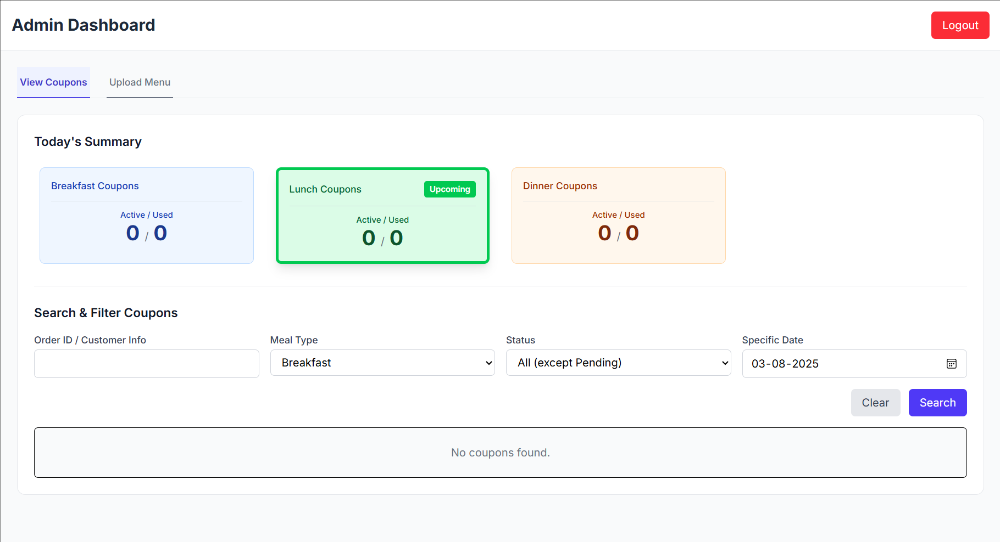
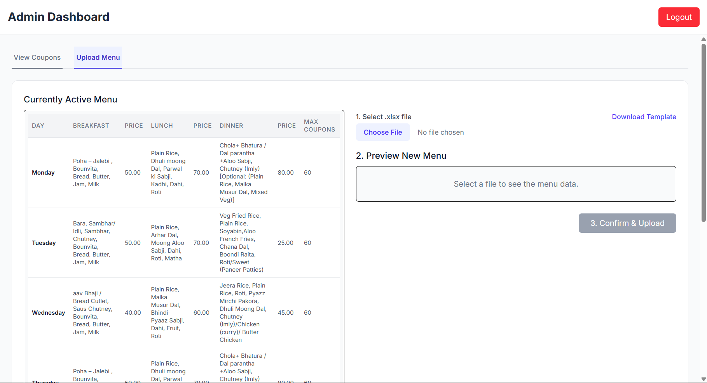

#  Admin Dashboard

The Admin Dashboard is the web interface used by mess administrators to manage and monitor various aspects of the VH Mess Application.

---

##  Features

- **Login & Auth**: Secure login with admin credentials.
- **Weekly Menu Upload**: Upload and preview upcoming meal menus (image or PDF).
- **View Bookings**: Filter and view all booked meals by date, meal type, and student.
- **Coupon Validation**: Mark and verify whether a coupon has been used.
- **Usage Summary**: Real-time daily summary of issued and redeemed coupons.

---

##  Navigation Overview

The dashboard includes the following tabs:

| Tab             | Purpose                                     |
|------------------|---------------------------------------------|
| `Upload Menu`     | Upload new weekly menu file of the sample format |
| `View Coupons`    | Filter, search and review issued coupons.  |
| `Validate Coupon` | Mark coupons as used via order ID.         |
| `Summary`         | View count of issued and used coupons.     |

---

##  Built With

- **HTML/CSS/JS**
- **Bootstrap** (for UI)
- **fetch** (for API calls)
- **Vanilla JavaScript** (modular and component-based)

---
