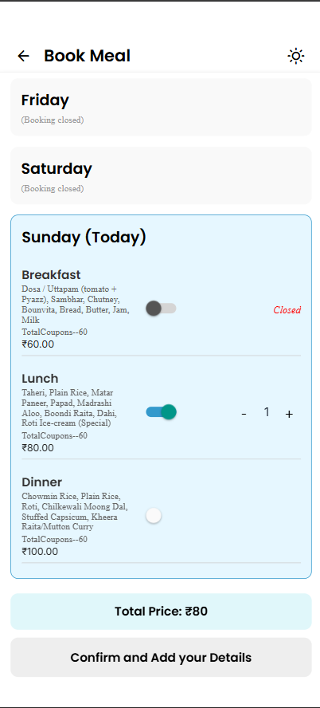

<h2><b>Features</b></h2>

- **Weekly Booking** – Users can book meals (Breakfast, Lunch, Dinner) for any day of the current week.
- **Dynamic Cutoff** – Booking is open only if current time is before the meal's cutoff time.
- **Switch-based Toggle** – Users can enable/disable meals using intuitive switches.
- **Quantity Counter** – Users can set the number of people per meal using + / – buttons.
- **Total Cost Calculation** – Displays live total cost before confirming.
- **Auto Scroll to Today** – On open, scrolls to today’s section for better UX.


---


<h2><b>Components</b></h2>

### `BookingScreen`

Main component that renders the weekly booking interface.

#### Key State

- `menuData`: Stores weekly menu per meal/day.
- `bookings`: Stores current selections (qty, price).
- `expandedDay`: Keeps track of which day is expanded in the UI.

---

<h2><b>Important Functions</b></h2>

### `fetchMenu()`

Fetches weekly menu from backend:
```ts
const fetchMenu = async () => {
  const raw = await getWeeklyMenu();
  setMenuData(raw);
};
```
isMealOpen(day, meal)
Checks if the selected meal is open for booking:

```ts
const isMealOpen = (day: string, meal: string): boolean => {
  const now = new Date();
  const cutoff = CUT_OFF[meal];
  return day !== todayLabel || 
         (now.getHours() < cutoff.hour || 
         (now.getHours() === cutoff.hour && now.getMinutes() < cutoff.minute));
};
```
toggleMeal(day, meal)
Toggles the meal switch ON/OFF:
```ts
const toggleMeal = (day: string, meal: MealKey) => {
  if (isPastDay(day) || !isMealOpen(day, meal)) {
    Alert.alert("Booking Closed", "Booking is closed for this selection.");
    return;
  }
  // toggles qty between 0 and 1
};
```
calculateTotalPrice()
Calculates total ₹ based on all selected meals:
```ts
const calculateTotalPrice = () =>
  Object.entries(bookings).reduce(
    (sum, [_, meals]) =>
      sum +
      Object.values(meals).reduce(
        (sub, info) => sub + info.qty * info.price,
        0
      ),
    0
  );
```
showConfirmationAlert()
Displays confirmation alert before order:

```ts

Alert.alert("Confirm Order", "Be 100% and Help us Save Food.", [
  { text: "Cancel", style: "cancel" },
  { text: "Submit", onPress: handleSubmit },
]);
```

<h2><b>Coupon Reset Logic</b></h2>
Coupons reset on 1st of the month using:

```ts

useEffect(() => {
  if (today.getDate() === 1) resetWeeklyCoupons();
}, []);
```
<h2><b>UI Logic</b></h2>
Days before today are disabled for booking.

Today’s section is auto-scrolled into view on screen load.

Each day expands/collapses on tap.

Meal options are disabled if the cutoff is passed.

Confirm button is disabled until total > ₹0.

<h2><b>Dependencies</b></h2>
getWeeklyMenu, fetchAndSetCutoffTimings, CUT_OFF from menuUtils.

dayNames, MealKey, MealDetails from initMenu.

useTheme, useFocusEffect, useRouter, useLocalSearchParams.

sessionStorage to store last reset date.