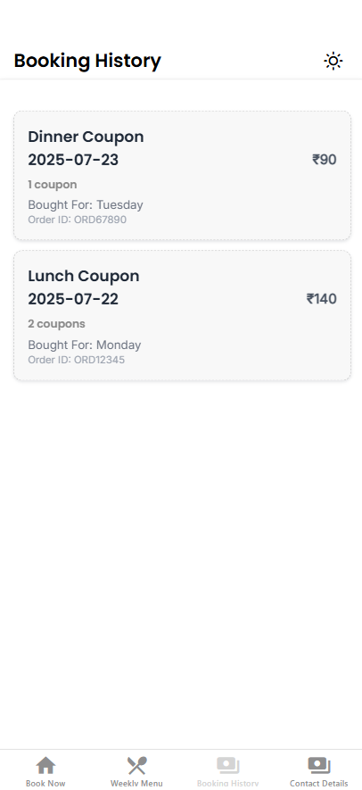

The **History** screen in the VH app displays the user's previously booked meal coupons. It allows users to view their booking details and generate a PDF receipt for each coupon.

---

##  Features

- Displays **past booked meals** with cost, date, and quantity.
- Shows **order ID**, **meal type**, and **booking day**.
- Option to **preview the coupon** in a receipt-like format.
- Generates a **sharable PDF** using `expo-print` and `expo-sharing`.
- Fetches data from local storage using `AsyncStorage`.
- SVG-based empty state illustration if no history is found.

---



##  Data Model

Each history entry is a `Meal` object with the following fields:

```ts
type Meal = {
  orderid: string,
  day: string,
  date: string,
  meal: string,
  qty: number,
  cost: number,
  receiptUrl?: string,
  userName?: string,
  booked: string,
};
```
##  Logic Overview

###  Data Loading

When the screen gains focus, it loads saved transactions from `AsyncStorage` using the key `transactions`.  
Transactions are sorted by most recent `date`.

###  UI Rendering

Each transaction is rendered as a `TouchableOpacity` card.

Each card displays:

- **Meal Type**
- **Booking Date & Day**
- **Total Price** (`cost × qty`)
- **Order ID**

###  Receipt Generation

Clicking a card opens a **modal WebView preview** of the receipt.  
Users can:

-  **Share the receipt as PDF** (generated via `Print.printToFileAsync`)
-  **Close** the preview modal

---

##  Receipt Design

The PDF receipt is rendered via HTML & CSS. It includes:

- App logo (fallback image if not available)
- User name and **Order ID**
- **Meal Type**, **Date**, and **Day**
- **Quantity** and **Cost per Meal**
- **Total Amount Paid**
- Footer: “VH Mess Application • IIT Kanpur”

---

##  Empty State

If no coupons exist:

- A centered **SVG illustration** (`empty.svg`) is displayed
- A CTA text encouraging user to **“Book Now!”**

---

##  Notes

- Uses `useFocusEffect()` from `@react-navigation/native`  
  → ensures fresh data on each tab revisit.
- Receipt preview uses a `WebView` to show HTML before generating PDF.
- All PDFs are stored **temporarily** and shared using `expo-sharing`.

---

##  Sample UX

| Action         | Outcome                                     |
|----------------|----------------------------------------------|
| Tap a card     | Preview receipt in a modal WebView          |
| Tap "Share PDF"| Generates and opens share dialog for receipt |
| No coupons     | SVG empty state illustration with message    |
