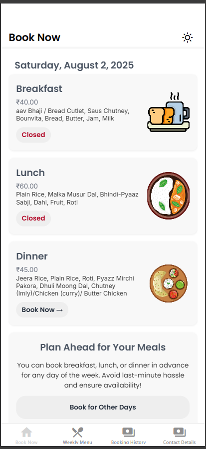

<h2><b>Features</b></h2>

- **Today's Meals Display** – Shows a card for each meal (Breakfast, Lunch, Dinner) with description, price,  and availability.
- **Live Booking Status** – The *Book Now →* button is dynamically enabled or disabled based on live cutoff time using the `isMealOpen()` logic.
- **Plan Ahead Card** – Encourages users to pre-book meals for the week with a call-to-action button.
- **Dynamic Theming** – Automatically adapts to the system theme (Dark/Light mode).

---


<h2><b>Components</b></h2>

### `HomeScreen` Component

This is the root component of the homepage, responsible for fetching and displaying today's meals.

#### Hooks Used

- `useEffect` – Loads data and fetches cutoff timings on mount.
- `useState` – Stores today’s meals and loading state.
- `useMemo` – Memoizes the dynamically themed styles.
- `useTheme` – Fetches light/dark theme context.
- `useRouter` – Used to navigate to booking screens.

---

### `loadTodayMeals()` Function

Fetches the weekly menu and selects today's meals based on the current weekday:

```ts
const loadTodayMeals = async () => {
  try {
    setLoading(true);
    const menu = await getWeeklyMenu();
    menu ? setTodayMeals(menu[today]) : setTodayMeals(null);
  } catch (error) {
    setTodayMeals(null);
  } finally {
    setLoading(false);
  }
};
```
isMealOpen() Logic
Checks if the booking for a particular meal is open based on current time and the defined cutoff for that meal.

```ts
const isMealOpen = (day: string, meal: string): boolean => {
  const now = new Date();
  const cutoff = CUT_OFF[meal];
  return now.getHours() < cutoff.hour || 
         (now.getHours() === cutoff.hour && now.getMinutes() < cutoff.minute);
};
```
<h2><b>Styling</b></h2>
Styles are generated dynamically based on dark or light mode.

Fonts used: Poppins, Inter.

Card shadows, colors, and spacing are theme-aware using Colors[mode].

<h2><b>Error Handling</b></h2>
If the menu fails to load, ErrorFetching component is rendered with a reload option.

<h2><b>Plan Ahead Section</b></h2>
At the bottom, an informative card encourages pre-booking meals:

```ts
<TouchableOpacity
  style={styles.fullButton}
  onPress={() => router.push('/(tabs)/booking')}
>
  <Text style={styles.buttonText}>Book for Other Days</Text>
</TouchableOpacity>
```